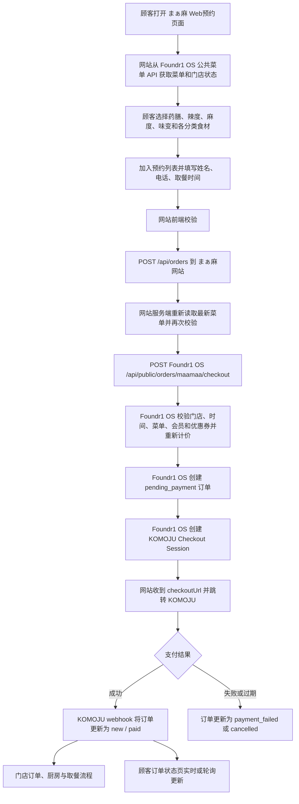

# まぁ麻麻辣烫网站 Web 预约下单逻辑

本文按当前代码实现，整理 まぁ麻（maamaa）网站从菜单展示、组装麻辣烫、提交订单、KOMOJU 支付，到门店接单、状态查询和取消退款的完整逻辑。

## 1. 系统职责边界

| 系统 | 主要职责 |
| --- | --- |
| まぁ麻品牌网站 | 展示菜单、收集顾客与取餐信息、组装购物车、做前端校验、跳转支付、展示订单状态 |
| Foundr1 OS | 菜单主数据、门店营业与排班状态、服务端重新校验和计价、订单落库、会员与优惠券、厨房生产数据、订单状态 |
| KOMOJU | 在线支付、支付结果通知、退款 |

核心原则：

- 菜单和价格以 Foundr1 OS 为最终依据，不能信任浏览器提交的名称或金额。
- まぁ麻是可自由搭配的麻辣烫，不使用奶茶的温度、甜度、冰量字段承载辣度或配料。
- 厨房生产信息使用结构化的 `customer_summary.maamaa`、`size_key = "maamaa_buildable"` 和 `topping_labels`。
- 订单只有在 KOMOJU 支付成功后，才从待支付状态进入门店的新订单状态。

## 2. 总体流程



## 3. 菜单读取逻辑

### 3.1 菜单来源

品牌网站通过 Foundr1 OS 标准公共菜单接口读取 まぁ麻菜单：

```text
GET /api/public/menus?brand=まぁ麻&store=<storeId>
```

网站把标准菜单转换为以下麻辣烫结构：

- 麻辣烫底锅 `baseSoup`
- 药膳选项 `medicinalSpiceOptions`
- 辣度 `heatLevels`
- 麻度 `numbLevels`
- 味变/追加调味 `specialFlavors`
- 食材分类 `menuSections`
- 门店预约设置 `storeOperation`
- 多语言名称 `displayNames`

网站正常展示时会缓存菜单，但指定门店的菜单和提交订单时会使用较新的数据；提交订单时明确使用 `no-store` 重新获取，避免顾客用旧价格或已售罄选项下单。

若 Foundr1 OS 菜单请求失败，网站目前存在本地 fallback 菜单。fallback 保障页面可显示，但最终结账仍会在 Foundr1 OS 端按当前主数据再次校验，因此不能绕过停售、价格或选项限制。

### 3.2 多语言

菜单名称、选项名和商品名来自 Foundr1 OS 的 `displayNames`。展示回退顺序为：

1. 顾客当前语言
2. 英语
3. 日语/源名称

品牌网站只维护页面、表单和错误提示等 UI 文案，不单独复制菜单翻译。

## 4. 顾客组装一碗麻辣烫

每一碗保存以下结构：

```ts
{
  spice: "药膳选项 ID",
  heat: "辣度 ID",
  numb: "麻度 ID",
  flavors: ["味变 ID"],
  items: {
    "食材选项 ID": 2
  }
}
```

单碗金额计算为：

```text
底锅价格
+ 药膳选项价格
+ 辣度价格
+ 麻度价格
+ 味变价格合计
+ Σ（食材单价 × 数量）
```

当前规则：

- 每一碗必须达到 `¥800`。
- 每个食材分类受菜单中的 `limit` 限制。
- 同一种食材可用数量表示；提交到 Foundr1 OS 时会展开成重复的选项 ID，再由 OS 统计数量。
- 一次订单最多 12 碗，此限制由 Foundr1 OS 结账接口执行。
- 购物车草稿保存在浏览器，菜单状态每 15 秒检查一次；菜单变化后会刷新可售内容。

## 5. 顾客信息、会员与优惠券

下单必填：

- 姓名
- 电话
- 取餐日期
- 取餐时间
- 至少一碗麻辣烫

若顾客已通过 Foundr1 会员交接登录，网站还会传递：

- `memberToken`
- `memberEmail`
- `memberPhone`
- `memberName`
- `couponId`

Foundr1 OS 根据会员引用解析会员身份。优惠券必须同时满足：

- 会员有效；
- 优惠券属于该会员；
- 优惠券当前可用；
- 适用于 まぁ麻品牌；
- 计算后的优惠额大于 0。

最终优惠金额和应付金额由 Foundr1 OS 根据服务端小计重新计算：

```text
应付金额 = 服务端商品小计 - 服务端优惠金额
```

优惠后至少保留 `¥1` 应付金额。浏览器传来的 `total` 主要用于完成页摘要，不作为 Foundr1 OS 收款金额的可信来源。

## 6. 取餐时间规则

当前 まぁ麻 Web 预约为保守上线规则：

- 只接受当日预约；
- Web 预约从 `12:00` 开始受理；
- 最晚取餐时间为 `23:00`；
- 默认最短提前时间为 15 分钟；
- 最短提前时间可由 Foundr1 OS 门店运营设置调整，范围为 0–240 分钟；
- 取餐时间必须在门店营业时间内；
- 取餐时间必须落在已确认的员工排班预约时段内；
- 临时闭店或临时不可预约时间不可下单；
- `reservationsEnabled = false` 时整个门店暂停 Web 预约。

网站前端会先限制日期和时间，但 Foundr1 OS 会再次按东京时区校验。服务端校验是最终标准。

系统还记录：

- `pickupTiming = "earliest"`：选择的是当前最早可取时间；
- `pickupTiming = "scheduled"`：选择的是稍后的预约时间；
- `minimumPickupMinutesAtOrder`：下单时使用的提前分钟数。

## 7. 网站提交接口

网站前端提交：

```text
POST /api/orders
```

主要请求字段：

```json
{
  "name": "顾客姓名",
  "phone": "电话号码",
  "memberToken": "会员公开 token",
  "memberEmail": "会员邮箱",
  "memberPhone": "会员电话",
  "memberName": "会员姓名",
  "couponId": "优惠券 ID",
  "pickupDate": "YYYY-MM-DD",
  "pickupTime": "HH:mm",
  "total": 1500,
  "items": [],
  "language": "ja"
}
```

网站服务端会：

1. 检查必填字段。
2. 重新读取最新菜单。
3. 检查底锅是否允许网站销售。
4. 检查所有选项 ID 是否仍存在、可选。
5. 检查分类选择上限。
6. 根据最新菜单重新计算每一碗是否达到 ¥800。
7. 把数量型食材转换为 Foundr1 OS 所需的按分类选项数组。
8. 调用 Foundr1 OS 结账接口。

传给 Foundr1 OS 的单碗结构：

```json
{
  "title": "第 1 碗显示名称",
  "medicinalSpice": "选项 ID",
  "heat": "选项 ID",
  "numb": "选项 ID",
  "specialFlavors": ["选项 ID"],
  "selections": {
    "分类 ID": ["食材 ID", "食材 ID"]
  },
  "completionSummary": {
    "title": "显示名称",
    "summary": ["顾客语言下的摘要"],
    "total": 1200
  }
}
```

## 8. Foundr1 OS 结账与订单落库

内部调用：

```text
POST /api/public/orders/maamaa/checkout
```

Foundr1 OS 会按以下顺序处理：

1. 确认门店属于 まぁ麻菜单。
2. 获取门店有效的 KOMOJU 支付账户。
3. 校验预约是否开放、底锅是否可售。
4. 校验日期、时间、营业时间、员工预约时段和临时闭店。
5. 从 Foundr1 OS 菜单主数据解析所有选项 ID。
6. 检查每个分类上限和选项合法性。
7. 重新计算每一碗及整单金额。
8. 解析会员并验证优惠券。
9. 生成 `M-xxxx` 格式的取餐号。
10. 创建本地订单，初始状态为 `pending_payment`，支付状态为 `pending`。
11. 创建 KOMOJU Checkout Session。
12. 保存 KOMOJU session ID，并返回 `checkoutUrl`。

### 8.1 订单主数据

订单写入 `store_customer_orders`，关键值包括：

- `order_source = "maamaa_web"`
- `payment_provider = "komoju"`
- 门店、品牌、取餐号、取餐日期时间
- 服务端最终应付金额
- 会员 ID
- 支付账户和支付 session
- 顾客摘要

### 8.2 结构化麻辣烫数据

完整搭配写入：

```text
customer_summary.maamaa
```

结构版本：

```text
schema = "maamaa_buildable_v1"
```

其中包含：

- 底锅 ID、菜单商品 ID、名称、价格；
- 每一碗的序号；
- 药膳、辣度、麻度、味变；
- 各食材分类；
- 每个食材的 ID、名称、单价、数量、小计；
- 每碗金额和生产摘要。

同时为每一碗创建 `store_customer_order_items` 记录：

- `size_key = "maamaa_buildable"`
- `menu_catalog_item_id = 底锅菜单商品 ID`
- `option_key / option_label = 味变`
- `topping_keys = 所有结构化选择 ID`
- `topping_labels = 厨房可读的去重计数标签`
- `amount = 该碗服务端计算金额`

这样厨房屏幕优先读取结构化数据，不会把顾客长摘要和配料列表重复展示。

## 9. KOMOJU 支付

Foundr1 OS 创建 KOMOJU Session 时使用：

- `mode = "payment"`
- `currency = "JPY"`
- `capture = "auto"`
- `external_order_num = 取餐号`
- metadata 保存订单 ID、取餐号、品牌、门店和支付账户 ID
- return URL 指向 まぁ麻网站的支付返回接口

网站收到 `checkoutUrl` 后：

1. 在浏览器保存最新预约摘要；
2. 约 100ms 后跳转 KOMOJU；
3. 若自动跳转未发生，3 秒后显示“用 KOMOJU 支付”的备用链接。

注意：KOMOJU 的浏览器 return 只负责把顾客带回订单状态页，不负责判定支付成功。支付结果以签名验证后的 webhook 为准。

## 10. 支付结果和门店接单

KOMOJU webhook 校验 `x-komoju-signature` 后，根据支付事件更新订单：

| KOMOJU 结果 | 订单状态 | 支付状态 |
| --- | --- | --- |
| captured / authorized | `new` | `paid` |
| failed / expired | `payment_failed` | `failed` |
| cancelled | `cancelled` | `canceled` |
| refunded | `cancelled` | `refunded` |

支付成功时：

- `pending_payment` 转为 `new`；
- 保存 payment ID、session ID、支付时间和回执地址；
- 发布 `order.created` 实时事件；
- 门店订单、厨房和取餐流程可以收到新订单。

因此“创建了 checkout session”不等于“门店已接单”，真正的门店新订单以支付成功 webhook 为准。

## 11. 支付返回与订单状态页

支付后顾客被带回：

```text
/api/orders/foundr1-return
```

该接口再跳转到：

```text
/stores/shimizu/orders/<orderId>?pickupCode=<M-xxxx>
```

订单状态页展示：

- 取餐号；
- 当前状态；
- 订单金额；
- 取餐日期时间；
- 支付状态；
- 搭配摘要；
- 支付后的收据预览；
- 可用时的取消退款按钮。

状态流程：

```text
待支付 → 订单受付(new) → 制作中(preparing) → 可取餐(ready) → 已交付(completed)
```

页面优先通过 Pusher 接收 `order.created` / `order.updated` 事件；实时连接不可用时，每 8 秒轮询一次。

## 12. 顾客取消与退款

只有满足以下全部条件时，顾客可从订单详情页取消：

- `order_source = "maamaa_web"`；
- 状态为 `pending_payment` 或 `new`；
- 尚未开始制作；
- 尚未 ready、completed 或 cancelled；
- 当前时间早于取餐时间 30 分钟。

取消请求：

```text
PATCH まぁ麻网站 /api/orders/<orderId>
  → PATCH Foundr1 OS /api/public/orders/status
```

并附带：

- `orderId`
- `pickupCode`
- `pickupDate`

处理过程：

1. Foundr1 OS 再次校验取消资格。
2. 使用数据库条件更新把订单锁定为 `refund_pending`，防止并发重复取消。
3. 已支付订单调用 KOMOJU payment refund API。
4. 退款成功后更新为 `cancelled / refunded`。
5. 未支付订单直接更新为 `cancelled`。
6. 反转该订单产生的会员权益，并同步销售订单。
7. 发布订单更新事件。

若已开始制作、距离取餐不足 30 分钟、支付信息缺失或 KOMOJU 退款失败，自动取消不会完成，页面提示顾客联系门店。

## 13. 关键校验分层

| 校验 | 浏览器 | まぁ麻网站服务端 | Foundr1 OS |
| --- | --- | --- | --- |
| 必填姓名/电话 | 是 | 是 | 使用摘要落库 |
| 至少一碗 | 是 | 是 | 是 |
| 每碗最低 ¥800 | 是 | 是，按新菜单重算 | 暂未独立校验 ¥800，只校验服务端计价结果大于 0 |
| 分类数量上限 | 是 | 是 | 是 |
| 选项是否有效 | 是 | 是 | 是 |
| 菜单价格 | 仅展示 | 重算单碗最低额 | 最终重算 |
| 当日/提前时间 | 是 | 错误映射 | 最终校验 |
| 营业时间/员工排班 | 来自菜单状态 | 错误映射 | 最终校验 |
| 临时闭店 | 间接 | 错误映射 | 最终校验 |
| 会员与优惠券 | 展示与选择 | 透传 | 最终验证和计价 |
| 支付结果 | 不可信 | 不判定 | KOMOJU webhook 判定 |

## 14. 关键实现文件

### まぁ麻网站

- `src/components/malatang-order-builder.tsx`：菜单选择、购物车、前端金额、预约时间、会员优惠券和提交。
- `src/app/api/orders/route.js`：网站订单代理、最新菜单复核、请求转换和错误本地化。
- `src/server/menu-source.js`：Foundr1 OS 标准菜单读取与转换。
- `src/app/api/orders/foundr1-return/route.js`：KOMOJU 支付返回跳转。
- `src/components/order-status-page.tsx`：订单状态、实时更新和取消退款 UI。
- `src/server/foundr1-orders.js`：订单状态、收据和取消请求代理。

### Foundr1 OS

- `app/api/public/orders/maamaa/checkout/route.ts`：最终校验、服务端计价、订单落库和 KOMOJU session。
- `app/api/public/orders/status/route.ts`：公共订单查询和顾客取消入口。
- `lib/customer-orders.ts`：订单读写、取消资格、KOMOJU 退款。
- `lib/komoju-webhooks.ts`：支付 webhook 验签和状态更新。
- `lib/maamaa-compatible-menu.ts`：まぁ麻菜单兼容结构。
- `lib/order-production.ts`：厨房生产摘要。

## 15. 当前实现中需要留意的点

- Foundr1 OS 会按菜单主数据重新计价，但 `maamaa/checkout` 目前没有独立执行“每碗至少 ¥800”的规则。正常网站链路会在网站前端和网站服务端执行两次，因此顾客页面无法正常绕过；若未来有新的 App、POS 或第三方入口直接调用 Foundr1 OS 接口，应把最低金额规则下沉到 Foundr1 OS。
- まぁ麻网站仍保留本地 fallback 菜单。它能避免菜单接口短暂失败时页面完全不可用，但也可能短暂展示旧商品；结账时 Foundr1 OS 的最终校验会拒绝无效选项。
- 浏览器 return URL 不能作为支付成功依据。订单是否进入门店必须以 KOMOJU webhook 更新后的 `paid / new` 为准。
- 顾客提交的 `total` 不能作为收款金额。KOMOJU Session 的金额来自 Foundr1 OS 的服务端重新计价。

## 16. 一句话总结

まぁ麻网站负责“让顾客选好并发起支付”，Foundr1 OS 负责“用最新主数据重新确认这单是否合法、应该收多少钱、如何进入门店和厨房”，KOMOJU webhook 负责“最终确认是否付款成功”。
